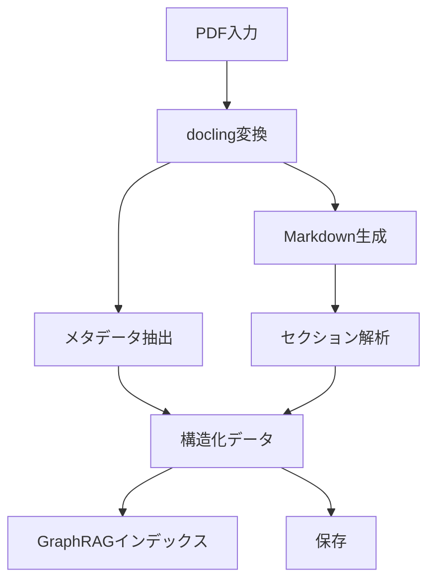
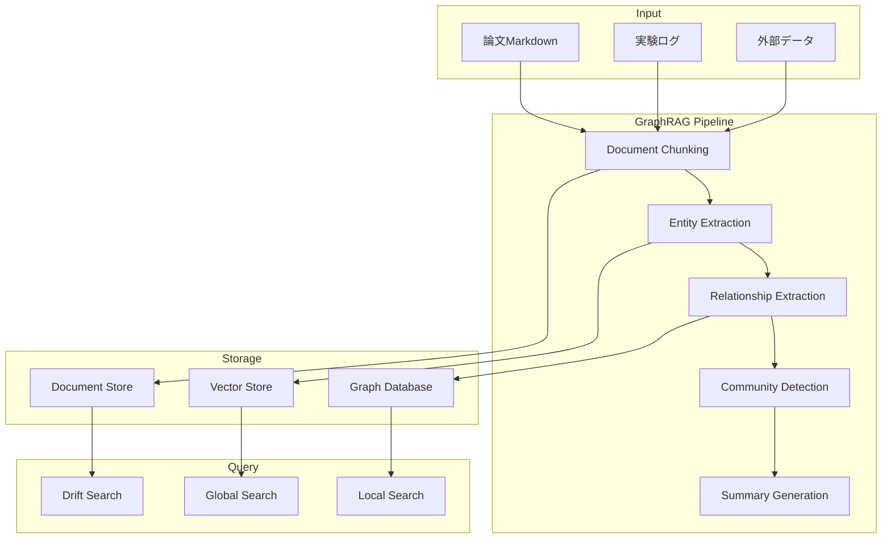

# REQ-002: ARIA 詳細機能仕様

> **作成日**: 2026-01-28  
> **バージョン**: 0.1.0  
> **ステータス**: Draft

---

## 1. 実験ノート記録システム

### 1.1 概要
GitHub Copilot とのやり取りを自動的に記録し、構造化された実験ログとして保存する。

### 1.2 データモデル

```typescript
interface ExperimentLog {
  id: string;                    // UUID
  experimentId: string;          // 実験識別子
  date: string;                  // ISO8601形式
  timestamp: number;             // Unix timestamp
  
  // メタデータ
  title: string;
  description?: string;
  tags: string[];
  category: ExperimentCategory;
  
  // Copilot対話記録
  interactions: CopilotInteraction[];
  
  // 実験データ
  inputs: ExperimentInput[];
  outputs: ExperimentOutput[];
  observations: string[];
  conclusions?: string;
  
  // 関連情報
  relatedPapers?: string[];      // 論文ID参照
  relatedExperiments?: string[]; // 関連実験ID
  
  // バージョン管理
  version: number;
  createdAt: string;
  updatedAt: string;
}

interface CopilotInteraction {
  id: string;
  timestamp: string;
  type: 'prompt' | 'response' | 'code' | 'error';
  content: string;
  model?: string;
  tokens?: {
    prompt: number;
    completion: number;
  };
  metadata?: Record<string, unknown>;
}

type ExperimentCategory = 
  | 'hypothesis'
  | 'data-collection'
  | 'analysis'
  | 'visualization'
  | 'model-training'
  | 'evaluation'
  | 'other';

interface ExperimentInput {
  name: string;
  type: 'file' | 'parameter' | 'data' | 'reference';
  value: string | number | boolean | object;
  source?: string;
}

interface ExperimentOutput {
  name: string;
  type: 'file' | 'metric' | 'visualization' | 'model';
  value: string | number | object;
  path?: string;
}
```

### 1.3 保存フォーマット

```yaml
# storage/experiments/2026/01/28/EXP-2026-01-28-001.yaml
id: "550e8400-e29b-41d4-a716-446655440000"
experimentId: "EXP-2026-01-28-001"
date: "2026-01-28"
timestamp: 1769558400000

title: "GraphRAG パラメータチューニング実験"
description: "chunk_size と overlap の最適値を探索"
tags:
  - graphrag
  - parameter-tuning
  - optimization
category: analysis

interactions:
  - id: "int-001"
    timestamp: "2026-01-28T10:30:00Z"
    type: prompt
    content: "GraphRAGのchunk_sizeパラメータの推奨値は？"
    model: "gpt-4o"
  - id: "int-002"
    timestamp: "2026-01-28T10:30:15Z"
    type: response
    content: "GraphRAGのchunk_sizeは..."
    tokens:
      prompt: 50
      completion: 200

inputs:
  - name: chunk_size
    type: parameter
    value: 300
  - name: overlap
    type: parameter
    value: 50

outputs:
  - name: recall_score
    type: metric
    value: 0.85
  - name: precision_score
    type: metric
    value: 0.78

observations:
  - "chunk_size=300で最良の結果"
  - "overlapは50以上で効果が飽和"

conclusions: "chunk_size=300, overlap=50を推奨設定とする"

version: 1
createdAt: "2026-01-28T10:30:00Z"
updatedAt: "2026-01-28T11:45:00Z"
```

---

## 2. 論文分析システム

### 2.1 概要
docling を使用してPDFをMarkdownに変換し、構造化されたメタデータを抽出する。

### 2.2 データモデル

```typescript
interface Paper {
  id: string;                    // UUID
  paperId: string;               // DOI or arXiv ID
  
  // 基本メタデータ
  title: string;
  authors: Author[];
  abstract: string;
  publishedDate?: string;
  venue?: string;                // ジャーナル/会議名
  
  // 分類
  categories: string[];
  keywords: string[];
  
  // 文書構造
  sections: Section[];
  figures: Figure[];
  tables: Table[];
  equations: Equation[];
  
  // 引用関係
  references: Reference[];
  citedBy?: string[];
  
  // ファイル情報
  originalPath: string;          // PDFパス
  markdownPath: string;          // 変換後Markdownパス
  
  // 処理情報
  processedAt: string;
  processingStatus: ProcessingStatus;
  
  // GraphRAG用
  embeddingId?: string;
  graphNodeId?: string;
}

interface Author {
  name: string;
  affiliation?: string;
  email?: string;
  orcid?: string;
}

interface Section {
  id: string;
  title: string;
  level: number;               // 1=H1, 2=H2, etc.
  content: string;
  startLine: number;
  endLine: number;
}

interface Figure {
  id: string;
  caption: string;
  path?: string;
  pageNumber?: number;
}

interface Table {
  id: string;
  caption: string;
  headers: string[];
  rows: string[][];
  pageNumber?: number;
}

interface Equation {
  id: string;
  latex: string;
  description?: string;
  inline: boolean;
}

interface Reference {
  id: string;
  citation: string;
  doi?: string;
  arxivId?: string;
  title?: string;
  authors?: string[];
  year?: number;
}

type ProcessingStatus = 
  | 'pending'
  | 'processing'
  | 'completed'
  | 'failed';
```

### 2.3 docling統合フロー



### 2.4 docling変換コード

```python
# packages/docling-adapter/src/converter.py
from docling.document_converter import DocumentConverter
from pathlib import Path
import json

class AriaDoclingConverter:
    def __init__(self):
        self.converter = DocumentConverter()
    
    def convert_paper(self, pdf_path: str, output_dir: str) -> dict:
        """PDFを変換し、構造化データを返す"""
        result = self.converter.convert(pdf_path)
        doc = result.document
        
        # Markdown出力
        md_content = doc.export_to_markdown()
        md_path = Path(output_dir) / f"{Path(pdf_path).stem}.md"
        md_path.write_text(md_content)
        
        # メタデータ抽出
        metadata = {
            "title": self._extract_title(doc),
            "authors": self._extract_authors(doc),
            "abstract": self._extract_abstract(doc),
            "sections": self._extract_sections(doc),
            "figures": self._extract_figures(doc),
            "tables": self._extract_tables(doc),
            "references": self._extract_references(doc),
        }
        
        return {
            "markdown_path": str(md_path),
            "metadata": metadata,
        }
```

---

## 3. GraphRAGシステム

### 3.1 概要
Microsoft GraphRAG を統合し、論文・実験データの高度な検索・推論を実現する。

### 3.2 アーキテクチャ



### 3.3 設定モデル

```yaml
# config/graphrag.yaml
graphrag:
  indexing:
    chunk_size: 300
    chunk_overlap: 50
    encoding_model: "cl100k_base"
    
  entity_extraction:
    model: "gpt-4o"
    max_entities: 20
    entity_types:
      - PERSON
      - ORGANIZATION
      - CONCEPT
      - METHOD
      - DATASET
      - METRIC
      
  community_detection:
    algorithm: "leiden"
    resolution: 1.0
    max_community_size: 100
    
  summarization:
    model: "gpt-4o"
    summary_max_tokens: 500
    
  storage:
    vector_store:
      type: "chroma"
      persist_directory: "./storage/knowledge-graph/vectors"
    graph_store:
      type: "neo4j"  # or "networkx" for local
      uri: "bolt://localhost:7687"
```

### 3.4 LazyGraphRAG実装

```typescript
// packages/graphrag/src/lazy-graphrag.ts
interface LazyGraphRAGConfig {
  mode: 'lazy' | 'full';
  cacheEnabled: boolean;
  maxCacheSize: number;
  ttlSeconds: number;
}

class LazyGraphRAG {
  /**
   * LazyGraphRAG: オンデマンドでグラフを構築
   * - 初回クエリ時にのみ関連部分のグラフを生成
   * - キャッシュにより重複処理を回避
   * - メモリ効率の良い増分更新
   */
  async query(question: string, options?: QueryOptions): Promise<QueryResult> {
    // 1. 関連ドキュメントの検索
    const relevantDocs = await this.vectorSearch(question);
    
    // 2. キャッシュ確認
    const cacheKey = this.computeCacheKey(relevantDocs);
    if (this.cache.has(cacheKey)) {
      return this.cache.get(cacheKey);
    }
    
    // 3. オンデマンドグラフ構築
    const subgraph = await this.buildSubgraph(relevantDocs);
    
    // 4. グラフベースの推論
    const result = await this.reasonOverGraph(subgraph, question);
    
    // 5. キャッシュ保存
    this.cache.set(cacheKey, result);
    
    return result;
  }
}
```

---

## 4. マルチLLMプロバイダー

### 4.1 概要
複数のLLMプロバイダーを統一インターフェースで利用可能にする。

### 4.2 プロバイダーインターフェース

```typescript
// packages/llm-providers/src/types.ts
interface LLMProvider {
  name: string;
  
  // 基本操作
  complete(prompt: string, options?: CompletionOptions): Promise<CompletionResult>;
  chat(messages: Message[], options?: ChatOptions): Promise<ChatResult>;
  embed(texts: string[]): Promise<number[][]>;
  
  // ストリーミング
  streamChat(messages: Message[], options?: ChatOptions): AsyncIterable<ChatChunk>;
  
  // 情報取得
  listModels(): Promise<ModelInfo[]>;
  getUsage(): Promise<UsageInfo>;
}

interface CompletionOptions {
  model?: string;
  maxTokens?: number;
  temperature?: number;
  topP?: number;
  stop?: string[];
}

interface Message {
  role: 'system' | 'user' | 'assistant';
  content: string;
}

interface ModelInfo {
  id: string;
  name: string;
  contextWindow: number;
  maxOutputTokens: number;
  capabilities: string[];
}
```

### 4.3 設定ファイル

```yaml
# config/aria.config.yaml
llm:
  default_provider: "azure-openai"
  
  providers:
    azure-openai:
      type: "azure-openai"
      endpoint: "${AZURE_OPENAI_ENDPOINT}"
      api_key: "${AZURE_OPENAI_API_KEY}"
      api_version: "2024-02-15-preview"
      deployments:
        chat: "gpt-4o"
        embedding: "text-embedding-3-large"
        
    openai:
      type: "openai"
      api_key: "${OPENAI_API_KEY}"
      models:
        chat: "gpt-4o"
        embedding: "text-embedding-3-large"
        
    anthropic:
      type: "anthropic"
      api_key: "${ANTHROPIC_API_KEY}"
      models:
        chat: "claude-3-5-sonnet-20241022"
        
    ollama:
      type: "ollama"
      base_url: "http://192.168.224.1:11434"
      models:
        chat: "llama3.2"
        embedding: "nomic-embed-text"

  # フォールバック設定
  fallback:
    enabled: true
    order:
      - azure-openai
      - openai
      - anthropic
      - ollama
```

---

## 5. MCPサーバー

### 5.1 概要
Model Context Protocol (MCP) を実装し、外部システムとの連携を可能にする。

### 5.2 ツール一覧

| ツール名 | 説明 | カテゴリ |
|----------|------|----------|
| `experiment_create` | 実験ログ作成 | Experiment |
| `experiment_update` | 実験ログ更新 | Experiment |
| `experiment_search` | 実験検索 | Experiment |
| `paper_import` | 論文インポート | Paper |
| `paper_analyze` | 論文分析 | Paper |
| `paper_search` | 論文検索 | Paper |
| `graphrag_index` | インデックス作成 | GraphRAG |
| `graphrag_query` | グラフクエリ | GraphRAG |
| `graphrag_local` | ローカル検索 | GraphRAG |
| `graphrag_global` | グローバル検索 | GraphRAG |

### 5.3 MCPサーバー実装

```typescript
// packages/mcp-server/src/server.ts
import { Server } from "@modelcontextprotocol/sdk/server/index.js";
import { StdioServerTransport } from "@modelcontextprotocol/sdk/server/stdio.js";

const server = new Server({
  name: "aria-mcp-server",
  version: "0.1.0",
}, {
  capabilities: {
    tools: {},
    resources: {},
    prompts: {},
  },
});

// ツール登録
server.setRequestHandler(ListToolsRequestSchema, async () => ({
  tools: [
    {
      name: "experiment_create",
      description: "Create a new experiment log",
      inputSchema: {
        type: "object",
        properties: {
          title: { type: "string", description: "Experiment title" },
          category: { type: "string", enum: ["hypothesis", "analysis", "..."] },
          tags: { type: "array", items: { type: "string" } },
        },
        required: ["title"],
      },
    },
    // ... 他のツール
  ],
}));

// ツール実行
server.setRequestHandler(CallToolRequestSchema, async (request) => {
  const { name, arguments: args } = request.params;
  
  switch (name) {
    case "experiment_create":
      return await experimentService.create(args);
    case "paper_import":
      return await paperService.import(args);
    case "graphrag_query":
      return await graphragService.query(args);
    default:
      throw new Error(`Unknown tool: ${name}`);
  }
});

async function main() {
  const transport = new StdioServerTransport();
  await server.connect(transport);
}

main().catch(console.error);
```

---

## 6. 次のステップ

1. [REQ-003: GitHub Copilot Agent Skills 仕様](./REQ-003-agent-skills.md)
2. [REQ-004: データベース・ストレージ設計](./REQ-004-storage-design.md)
3. [REQ-005: API仕様](./REQ-005-api-specs.md)
